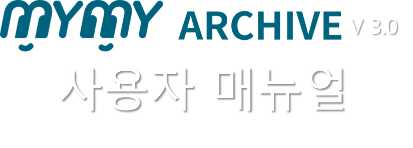

# 소개

## 개요

MYMY는 디지털 자산 관리 및 아카이브 솔루션으로, 사용자들이 다양한 미디어 파일을 효율적으로 관리하고 검색할 수 있도록 돕습니다. MYMY는 직관적인 인터페이스와 강력한 기능을 제공하여 사용자들이 쉽게 디지털 자산을 업로드, 관리, 검색, 공유할 수 있습니다.

## 주요 기능

### 1. 통합 검색
MYMY의 통합 검색 기능은 사용자가 원하는 파일을 빠르게 찾을 수 있도록 도와줍니다. 다양한 메타데이터를 기반으로 한 고급 검색 기능을 제공합니다.

### 2. 사용자 설정
사용자는 자신의 계정 정보를 쉽게 관리하고, 비밀번호를 변경하거나 개인 설정을 조정할 수 있습니다.

### 3. 업로드 및 다운로드 관리
사용자는 다양한 미디어 파일을 업로드하고 다운로드할 수 있으며, 이를 효율적으로 관리할 수 있습니다. 업로드 및 다운로드 이력을 쉽게 확인하고 관리할 수 있습니다.

### 4. 카테고리 및 애뉴얼 뷰
MYMY는 카테고리 및 애뉴얼 뷰를 제공하여 파일을 구조적으로 관리하고 손쉽게 접근할 수 있게 합니다. 카테고리 뷰에서는 폴더별로 파일을 관리하고, 애뉴얼 뷰에서는 연도별, 월별, 일별로 파일을 조회할 수 있습니다.

### 5. 커뮤니티 기능
사용자는 커뮤니티를 만들어 다른 사용자와 함께 파일을 공유하고 의견을 나눌 수 있습니다. 커뮤니티 내에서 미디어 파일을 업로드하고, 댓글을 통해 소통할 수 있습니다.

## 기술 지원

MYMY는 사용자들의 원활한 사용을 위해 다양한 기술 지원을 제공합니다. 문제가 발생하거나 도움이 필요할 경우, 고객지원센터에 문의할 수 있습니다.

### 고객지원센터
- **주소:** 서울시 구로구 디지털로 33길 11, 408호 (에이스테크노타워8차)
- **전화:** 02-857-1101 (기술지원팀)
- **홈페이지:** [www.gemiso.co.kr](https://www.gemiso.co.kr)
