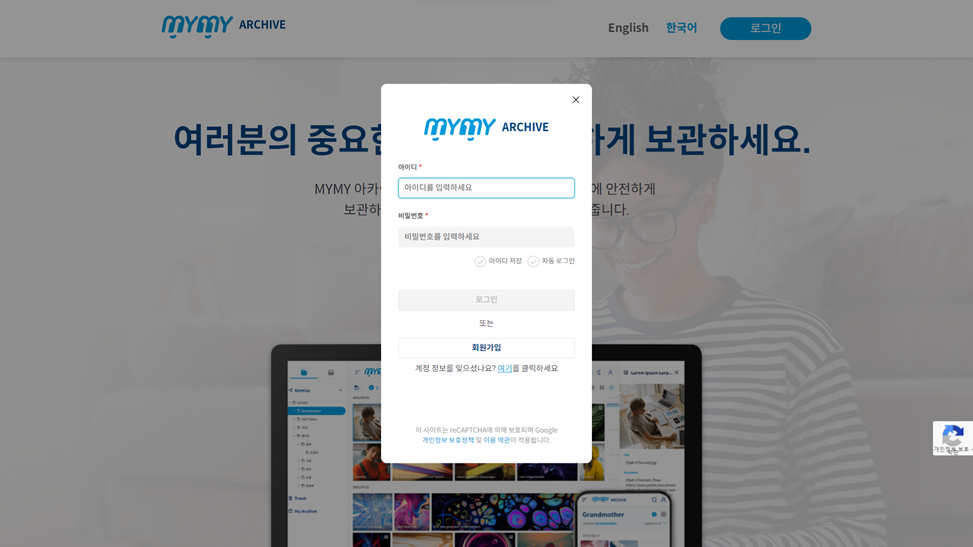

# 로그인 페이지

### 로그인 절차

1. **랜딩 페이지 접근**
   - PC에서 웹 브라우저를 실행하여 주소창에 `https://gs-test.mymy.io/`를 입력하면 랜딩 페이지가 나타납니다.

2. **로그인 버튼 클릭**
   - 랜딩 페이지에서 ‘로그인’ 버튼을 클릭하면 로그인 팝업창이 열립니다.

3. **로그인 정보 입력**
   - **아이디 입력**: MYMY에 등록된 ID를 입력합니다.
   - **비밀번호 입력**: ID를 등록할 때 입력한 비밀번호를 입력합니다.

4. **추가 옵션 선택**
   - **아이디 저장**: 버튼을 클릭하면 다음에 로그인 팝업을 열었을 때 ‘아이디’ 입력 박스에 로그인 했던 ID가 표시됩니다.
   - **자동 로그인**: 버튼을 클릭하면 MYMY에 다시 접속할 때 자동으로 로그인됩니다.

5. **로그인**
   - ID와 비밀번호를 입력하면 ‘로그인’ 버튼이 활성화됩니다. 버튼을 클릭하면 아카이브 홈 화면으로 이동합니다.

### 로그인 팝업 화면 구성

| 항목                | 설명                                                                  |
|-------------------|---------------------------------------------------------------------|
| **아이디 입력 박스**  | MYMY에 등록된 ID를 입력합니다.                                            |
| **비밀번호 입력 박스** | ID를 등록할 때 입력한 비밀번호를 입력합니다.                                  |
| **아이디 저장 버튼**  | 버튼을 클릭하면 다음에 로그인 팝업을 열었을 때 ‘아이디’ 입력 박스에 로그인 했던 ID가 표시됩니다.   |
| **자동 로그인 버튼**  | 버튼을 클릭하면 MYMY에 다시 접속할 때 자동으로 로그인됩니다.                       |
| **로그인 버튼**     | ID와 비밀번호를 입력하면 버튼이 활성화됩니다. 버튼을 클릭하면 아카이브 홈 화면으로 이동합니다. |
| **회원가입 버튼**    | 버튼을 클릭하면 ‘회원가입’ 팝업이 열립니다.                                   |
| **비밀번호 찾기 버튼** | 버튼을 클릭하면 ‘비밀번호 찾기’ 팝업이 열립니다.                                 |

### 비밀번호 찾기

1. **비밀번호 찾기 버튼 클릭**
   - 로그인 팝업에서 ‘여기’ 버튼을 클릭하면 ‘비밀번호 찾기’ 팝업이 열립니다.

2. **비밀번호 찾기 옵션 선택**
   - **이메일로 찾기**: 버튼을 클릭하면 ‘이메일로 찾기’ 팝업으로 이동합니다. MYMY에 등록된 이메일 주소를 입력하여 비밀번호 수정 메일을 받습니다.
   - **관리자 초기화 요청하기**: 버튼을 클릭하면 ‘관리자 초기화 요청’ 팝업으로 이동합니다. MYMY에 등록된 이메일 주소를 입력하여 관리자에게 비밀번호 초기화를 요청합니다.

### 이메일로 비밀번호 찾기 팝업 화면 구성

| 항목                   | 설명                                                                 |
|----------------------|--------------------------------------------------------------------|
| **이메일 입력 박스**    | MYMY에 등록된 이메일 주소를 입력합니다.                                        |
| **비밀번호 수정 메일 받기** | 입력한 이메일 주소로 비밀번호 수정 메일이 발송됩니다.                                  |

### 관리자 초기화 요청 팝업 화면 구성

| 항목                      | 설명                                                                 |
|-------------------------|--------------------------------------------------------------------|
| **이메일 입력 박스**       | MYMY에 등록된 이메일 주소를 입력합니다.                                        |
| **관리자 초기화 요청 버튼**  | 버튼을 클릭하면 관리자 알림에 입력한 이메일 주소를 갖는 계정의 비밀번호 초기화 요청 알람이 발생합니다. |

### 주의 사항

- **아이디 및 비밀번호**는 로그인 시 필수 입력 사항이며, 비밀번호는 등록 시 설정한 것을 정확히 입력해야 합니다.
- **자동 로그인 및 아이디 저장** 기능을 사용할 경우, 공용 컴퓨터에서는 사용을 자제하는 것이 좋습니다.
- 비밀번호를 잊어버린 경우, **비밀번호 찾기** 기능을 이용하여 이메일로 비밀번호를 재설정하거나, 관리자에게 초기화를 요청할 수 있습니다.
