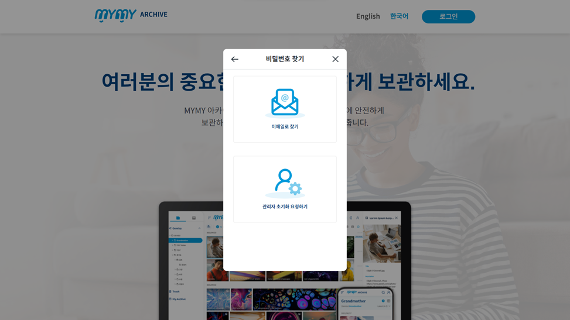
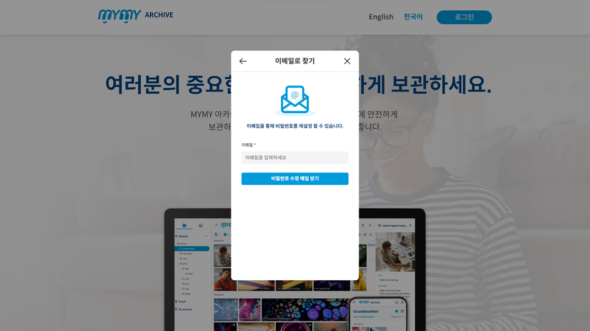
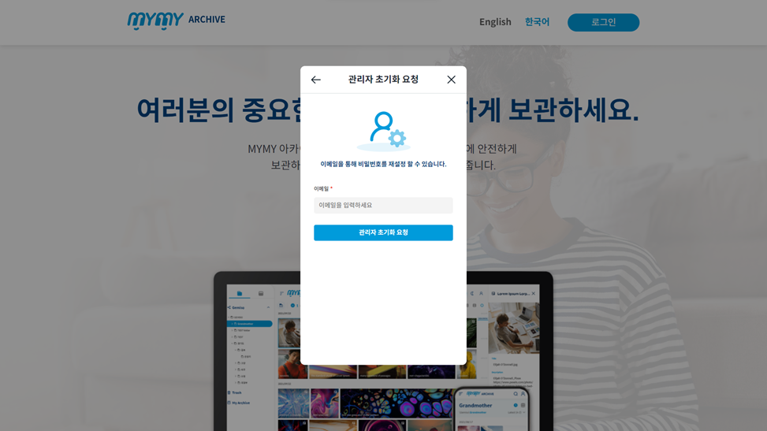

## 비밀번호 찾기

### 비밀번호 찾기 절차

1. **랜딩 페이지 접근**
   - PC에서 웹 브라우저를 실행하여 주소창에 `https://gs-test.mymy.io/`를 입력하면 랜딩 페이지가 나타납니다.

2. **로그인 버튼 클릭**
   - 랜딩 페이지에서 ‘로그인’ 버튼을 클릭하면 로그인 팝업창이 열립니다.

3. **비밀번호 찾기 버튼 클릭**
   - 로그인 팝업에서 ‘여기’ 버튼을 클릭하면 ‘비밀번호 찾기’ 팝업이 열립니다.

4. **비밀번호 찾기 옵션 선택**
   - **이메일로 찾기**: 버튼을 클릭하면 ‘이메일로 찾기’ 팝업으로 이동합니다. MYMY에 등록된 이메일 주소를 입력하여 비밀번호 수정 메일을 받습니다.
   - **관리자 초기화 요청하기**: 버튼을 클릭하면 ‘관리자 초기화 요청’ 팝업으로 이동합니다. MYMY에 등록된 이메일 주소를 입력하여 관리자에게 비밀번호 초기화를 요청합니다.

### 이메일로 비밀번호 찾기 팝업 화면 구성

| 항목                   | 설명                                                                 |
|----------------------|--------------------------------------------------------------------|
| **이메일 입력 박스**    | MYMY에 등록된 이메일 주소를 입력합니다.                                        |
| **비밀번호 수정 메일 받기** | 입력한 이메일 주소로 비밀번호 수정 메일이 발송됩니다.                                  |

### 관리자 초기화 요청 팝업 화면 구성

| 항목                      | 설명                                                                 |
|-------------------------|--------------------------------------------------------------------|
| **이메일 입력 박스**       | MYMY에 등록된 이메일 주소를 입력합니다.                                        |
| **관리자 초기화 요청 버튼**  | 버튼을 클릭하면 관리자 알림에 입력한 이메일 주소를 갖는 계정의 비밀번호 초기화 요청 알람이 발생합니다. |

### 주의 사항

- **이메일 주소**는 MYMY에 등록된 이메일 주소여야 합니다. 등록된 이메일 주소를 모를 경우, 관리자의 도움을 받아야 합니다.
- **비밀번호 수정 메일**은 입력한 이메일 주소로 발송되므로, 메일함에서 확인해야 합니다. 메일이 도착하지 않으면 스팸 메일함도 확인하십시오.
- **관리자 초기화 요청**은 비밀번호를 재설정할 수 없는 경우에만 사용하며, 요청 후 관리자의 승인을 기다려야 합니다.

### 비밀번호 찾기 화면 구성 예시

#### 비밀번호 찾기 팝업

#### 이메일로 찾기 팝업

#### 관리자 초기화 요청 팝업

### 비밀번호 찾기 팁

- 비밀번호를 자주 변경하여 보안을 유지하십시오.
- 비밀번호는 영문 대/소문자, 숫자, 특수문자 조합으로 설정하여 강도를 높이십시오.
- 비밀번호 찾기 절차를 마친 후, MYMY 계정에 로그인하여 정상적으로 비밀번호가 변경되었는지 확인하십시오.
